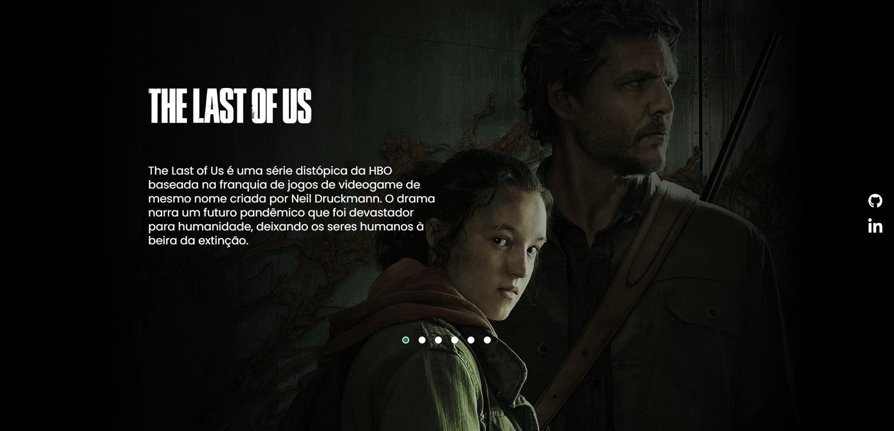

  

<h1 align="center">
  Matías Ezequiel Correa - Projeto "The Last of Us"
</h1>

  Este é um projeto pessoal sobre uma Landing Page do <a href="https://matias-ezequiel-correa.github.io/projeto-the-last-of-us/" target="_blank">The Last of Us | Série </a>, feito com o básico da programação frontend, atualmente hospedado no <a href="https://github.com/matias-ezequiel-correa">GitHub-Pages</a>.

## Desing: 
* Desktop:
[
](https://matias-ezequiel-correa.github.io/projeto-the-last-of-us/)

### 🔗 Link do Projeto: <a href="https://matias-ezequiel-correa.github.io/projeto-the-last-of-us/" target="_blank">matias-ezequiel-correa.github.io/projeto-the-last-of-us/</a>

## Tecnologias utilizadas:

 * HTML
 * CSS
 * JAVASCRIPT

 ### Pra entrar em contato, veja as redes abaixo!
 

 
  
  
   

